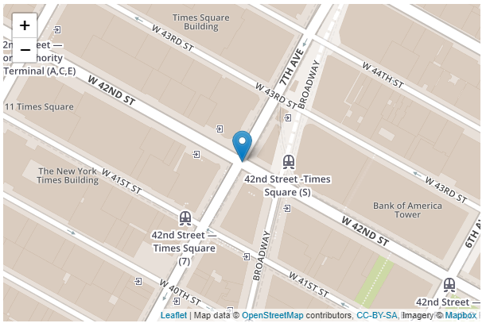

# Geolocation Custom Element for Kentico Kontent

This is a [custom element](https://docs.kontent.ai/tutorials/develop-apps/integrate/integrating-your-own-content-editing-features) for [Kentico Kontent](https://kontent.ai) that allows you you to put a marker on a map and it automatically gets converted to latitude and longitude geo locations.

This element is based on <https://leafletjs.com/> service that uses <https://www.openstreetmap.org/> together with the <https://www.mapbox.com/> service.



## Setup

1. Deploy the code to a secure public host
   - See [deploying section](#Deploying) for a really quick option
   - NOTE: you can use it as-is for testing purposes, but otherwise you need to generate your own MapBox access token and update line 70 in the html file.
1. Follow the instructions in the [Kentico Kontent documentation](https://docs.kontent.ai/tutorials/develop-apps/integrate/integrating-your-own-content-editing-features#a-3--displaying-a-custom-element-in-kentico-kontent) to add the element to a content model.
   - The `Hosted code URL` is where you deployed to in step 1
   - Pass any desired optional parameters as directing in the [JSON Parameters configuration](#json-parameters) section of this readme.

## Deploying

Netlify has made this easy. If you click the deploy button below, it will guide you through the process of deploying it to Netlify and leave you with a copy of the repository in your GitHub account as well.

[](https://app.netlify.com/start/deploy?repository=https://github.com/hzik/kc_geolocation)

## JSON Parameters

You are not required to specify any parameters to use this custom element. If desired, you can specify the default width/height of the map, default latitude and longitude and the zoom of the map.

All parameters are optional.

```Json
{
  "width": 800,
  "height": 600,
  "lat": 46.123,
  "lng": 16.123,
  "zoom": 10
}
```

## Saved Value

The value is saved as a serialized JSON objecy representing the selected coordinates and zoom level:

```Json
{
  "lat": 46.123,
  "lng": 16.123,
  "zoom": 10
}
```
